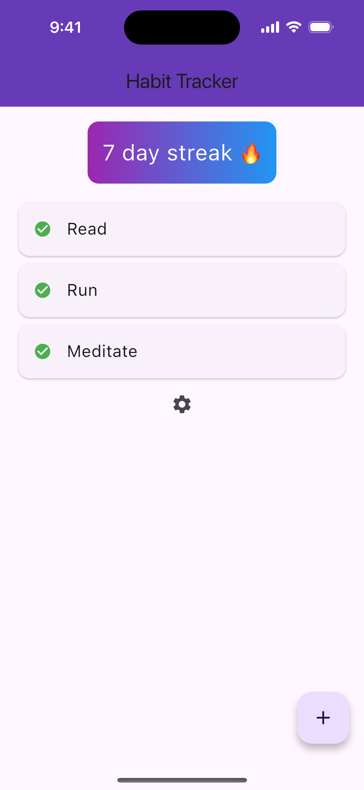
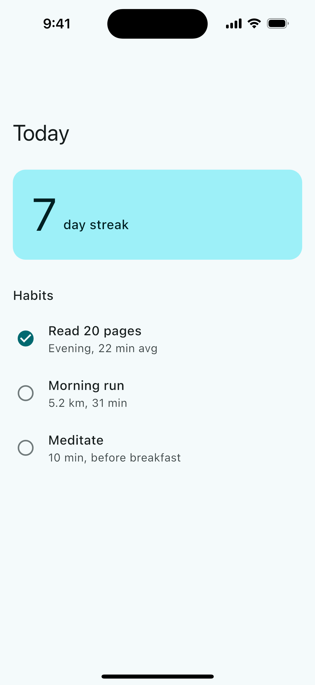
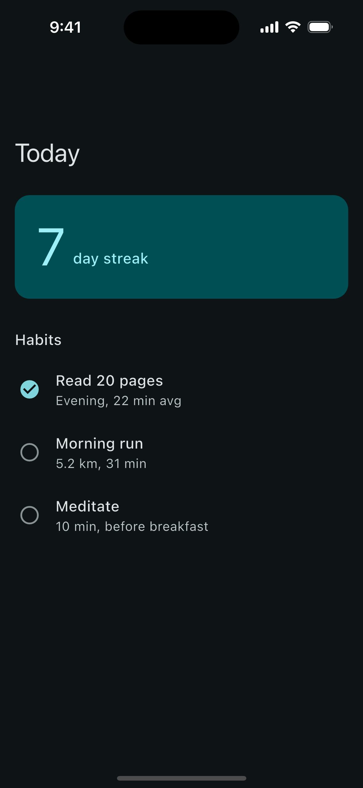
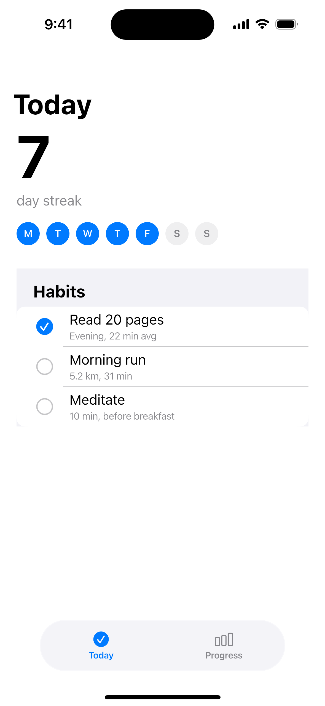
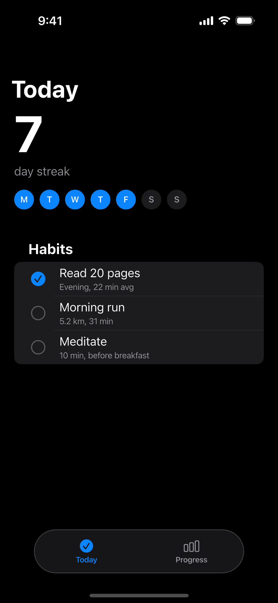

# flutter-design

**The design skill Flutter never had.** Stops default-purple Material slop, then looks at what it built.

      

Works with Claude Code, Cursor, Codex, Copilot, Gemini CLI and any agent that reads `SKILL.md` or `AGENTS.md`. Flutter 3.47+ aware (`material_ui` / `cupertino_ui`), Material 3, Cupertino, adaptive, web and desktop.

Same habit screen on an iPhone 16. **Before** is what an agent ships with no design skill. **After** is the same screen once this skill has run.

| Before | After · Material, light | After · Material, dark | After · iOS, light | After · iOS, dark |
| --- | --- | --- | --- | --- |
|  |  |  |  |  |

## Install

```bash
# any agent (skills.sh format)
npx skills add priyeshchowta/flutter-design-skill

# Claude Code
/plugin marketplace add priyeshchowta/flutter-design-skill
/plugin install flutter-design@flutter-design-skill

# Cursor: install via the plugin in .cursor-plugin/, or copy skills/flutter-design/ into .cursor/skills/
# Copilot / Codex / others without skill support: copy AGENTS.md (under 4k characters)
```

The scripts need only the Dart SDK. CI on GitHub Actions runs `flutter analyze`, the tests, both audit examples, and a compile check of every rule snippet on Flutter 3.47.

Other agent entry points, besides the skill folder:

| Agent | File |
|-------|------|
| Copilot | `.github/copilot-instructions.md` |
| Cursor rules | `.cursor/rules/flutter-design.mdc` |
| Codex | `skills/flutter-design/agents/openai.yaml` |
| Gemini CLI | `GEMINI.md` |
| Windsurf | `.windsurf/rules/flutter-design.md` |
| Anything that reads a root file | `AGENTS.md` |

## Flutter AI-slop tells it refuses

| Tell | Rule |
|------|------|
| `ColorScheme.fromSeed(seedColor: Colors.deepPurple)` untouched | `theme-default-seed` |
| `Colors.blue`, `Color(0xFF...)` inside widgets | `theme-raw-colors` |
| `TextStyle(fontSize: 18)` inline | `theme-inline-textstyle` |
| `brightness == Brightness.dark ? a : b` in widgets | `theme-brightness-branch` |
| Grids of identical icon + title + text cards | `layout-card-soup` |
| `AnimatedContainer` and fade-slide on everything | `motion-one-moment` |
| Emoji as icons, purple-blue gradients, ALL CAPS eyebrows | `icon-no-emoji`, `color-no-gradient-slop`, `type-no-allcaps-eyebrow` |
| `IconButton` with no label, 20dp tap targets | `a11y-semantics-label`, `a11y-tap-target` |
| Layout that breaks at 2x text | `a11y-text-scale-2x` |

## How it works

1. **Design Read**: one line naming screen, audience, vibe, platform.
2. **Dials**: VARIANCE / MOTION / DENSITY (1-10), mapped to Dart values.
3. **Token plan**: `DESIGN.md` with colors to `ColorScheme`, fonts to `TextTheme`, spacing, radius, motion.
4. **Build with tokens only.**
5. **Verify**: `audit.dart` plus a golden matrix (device x light/dark x text 1.0/2.0 x LTR/RTL) and `meetsGuideline` accessibility tests.
6. **Critique once, fix once.**

### Commands
`shape`, `theme`, `typeset`, `layout`, `adapt`, `animate`, `audit` (/20), `critique` (/40), `polish`, `harden`.

### Scripts
```bash
cd skills/flutter-design
dart run scripts/search.dart "fintech bold" --domain palette -n 3
dart run scripts/search.dart "habit tracker calm" --design-system   # prints ColorScheme + TextTheme + Motion in Dart
dart run scripts/audit.dart lib/                                    # file:line  RULE  severity
dart run scripts/audit.dart lib/ --json
```

## Before / after

Source: `examples/habit_tracker/before`, `examples/habit_tracker/after`, `examples/habit_tracker/ios`.

```
$ dart run scripts/audit.dart examples/habit_tracker/before   ->  11/20, 2 P0, 10 P1
$ dart run scripts/audit.dart examples/habit_tracker/after    ->  20/20
```

`templates/golden_matrix_test.dart` is the device x theme x text-scale x direction harness. Running it locally against the after screen caught a real overflow at 2.0x text scale in the streak header. CI does not render those goldens. It analyzes, tests the audit and palette contrast, and compiles every rule snippet.

## What is different

| | flutter-design | UI UX Pro Max (Flutter) | flutter/agent-plugins | VGV plugin |
|---|---|---|---|---|
| Flutter-native visual design | yes | 52 generic rows | no | partial |
| Palettes mapped to `ColorScheme` | yes | web output | no | no |
| Fonts mapped to `TextTheme` | yes | web output | no | no |
| Anti-slop bans with detector | yes (`audit.dart`) | no | no | no |
| Golden + a11y guideline matrix | yes | no | partial | no |
| Adaptive window classes, Cupertino | yes | no | 1 breakpoint | no |
| Motion tokens and reduce-motion | yes | no | no | basic |
| Flutter 3.47 `material_ui` aware | yes | no | no | no |
| State-management neutral | yes | n/a | yes | Bloc-tied |

Comparison reflects research as of Oct 2026.

## Layout

```
skills/flutter-design/   SKILL.md router, reference/ (commands, 111 rules, platform), data/, scripts/, templates/
evals/evals.json         behavior expectations, not yet run against an agent
examples/habit_tracker/  before, after (Material), ios (glass tab bar)
docs/screenshots/        iPhone 16 captures, light and dark
AGENTS.md                compact rules for agents without skills
.claude-plugin/ .cursor-plugin/
```

Rule IDs are filenames in `skills/flutter-design/reference/rules/` (prefixes `a11y- theme- state- layout- platform- color- type- motion- perf- icon- copy-`). Each has impact, severity, Incorrect and Correct Dart, and a source.

## Palette seeds

`search.dart --design-system` builds light and dark schemes with `ColorScheme.fromSeed` only. The extra hex values in `palettes.csv` are accent ideas for a `ThemeExtension`. Copying a raw hex onto `secondary` or `tertiary` leaves the generated `onSecondary` / `onTertiary` below 4.5:1 for most of the catalog. `test/palette_contrast_test.dart` checks the `fromSeed` schemes.

## Honest limits

- `audit.dart` is a heuristic detector (regex and balanced-call checks); it cannot judge contrast or hierarchy. Always render.
- Material 3 Expressive and Liquid Glass have no official Flutter implementation as of Flutter 3.47; those modules are opt-in with fallbacks.
- Data lists (palettes, fonts, styles) are curated starting points, not exhaustive.

## Contributing

See [CONTRIBUTING.md](CONTRIBUTING.md). Add a rule under `reference/rules/` with a prefixed ID, Incorrect and Correct Dart, and a source. Add an audit check only when it can be decided without an LLM.

## License

MIT
